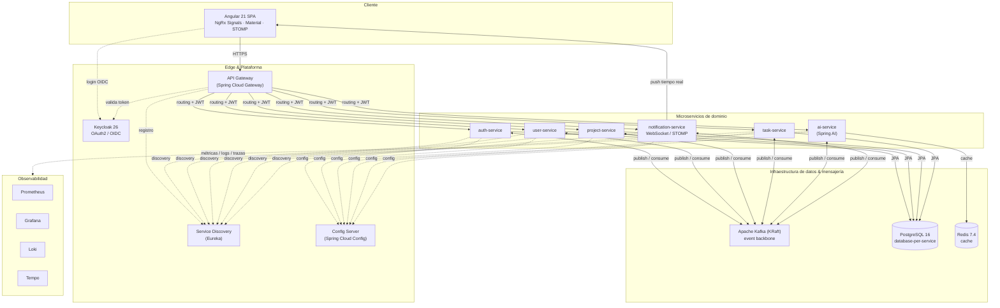
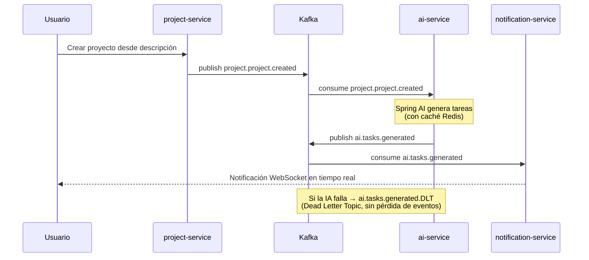

<div align="center">

# Intelligent Project Management SaaS

**Plataforma SaaS multi-tenant de gestión de proyectos con asistencia de IA, construida como un sistema distribuido orientado a eventos sobre microservicios Java.**

[](https://github.com/ErickJoelQuispe/Intelligent-Project-Management-SaaS/actions)


*9 microservicios · Arquitectura hexagonal · Event-driven sobre Kafka · OAuth2/OIDC · Spring AI · Observabilidad full-stack*

</div>

---

## ¿Qué demuestra este proyecto?

Un sistema distribuido **de grado profesional**, no un tutorial. Cada decisión de arquitectura está documentada con sus tradeoffs en [ADRs](./docs/adr/):

- **9 microservicios Java** independientes con `database-per-service` y consistencia eventual.
- **Arquitectura hexagonal (puertos y adaptadores)** en cada servicio, validada automáticamente con **ArchUnit** en CI.
- **Coreografía orientada a eventos sobre Kafka** con **patrón Outbox** y **Dead Letter Topics (DLT)** para tolerancia a fallos.
- **Seguridad delegada a Keycloak** (OAuth2/OIDC) en lugar de auth propia: menos superficie de ataque, RBAC robusto.
- **IA provider-agnostic** vía Spring AI con caché Redis y control de costes.
- **Observabilidad completa**: métricas (Prometheus/Grafana), logs (Loki), trazas distribuidas (Tempo).
- **CI/CD real**: GitHub Actions → tests → SonarCloud → imágenes versionadas en GHCR → escaneo de CVEs con Trivy.

---

## Arquitectura del sistema



### Flujo orientado a eventos (coreografía Kafka)

En lugar de orquestación acoplada, los servicios reaccionan a eventos de dominio. Ejemplo del flujo de IA con tolerancia a fallos:



> El sistema define **27 topics de dominio** con DLTs dedicados para los flujos críticos, garantizando que ningún evento se pierda ante fallos transitorios.

---

## Stack tecnológico

| Capa | Tecnología |
|------|-----------|
| Lenguaje | Java 21 LTS |
| Framework | Spring Boot 3.5 + Spring Cloud 2025.0 |
| API Gateway | Spring Cloud Gateway |
| Service Discovery | Eureka |
| Config centralizado | Spring Cloud Config |
| Mensajería | Apache Kafka (KRaft) |
| Base de datos | PostgreSQL 16 (database-per-service) |
| Cache | Redis 7.4 |
| Seguridad | Keycloak 26 (OAuth2/OIDC) |
| IA | Spring AI 1.0 (provider-agnostic) |
| Frontend | Angular 21 · NgRx Signals · Angular Material |
| Tiempo real | WebSocket / STOMP |
| Observabilidad | Prometheus · Grafana · Loki · Tempo |
| Calidad | JUnit 5 · Testcontainers · ArchUnit · SonarCloud |
| CI/CD | GitHub Actions · GHCR · Trivy |

---

## Microservicios

| Servicio | Responsabilidad |
|----------|-----------------|
| **api-gateway** | Punto de entrada único: routing, filtrado de autenticación, validación JWT |
| **discovery-service** | Registro y descubrimiento de servicios (Eureka) |
| **config-service** | Configuración centralizada y externalizada |
| **auth-service** | Autenticación, autorización y emisión de tokens (integra Keycloak) |
| **user-service** | Perfiles de usuario, equipos y membresías |
| **project-service** | Gestión de proyectos, settings y asignación de equipos |
| **task-service** | Tareas, jerarquía, estados, prioridades y deadlines |
| **ai-service** | Generación de tareas, resúmenes y análisis de backlog vía Spring AI |
| **notification-service** | Notificaciones en tiempo real (WebSocket/STOMP) y email (Thymeleaf) |

---

## Cómo levantar el entorno local

### Prerequisitos

- Docker Engine 24+ o Docker Desktop 4+
- Java 21 JDK (recomendado vía [SDKMAN](https://sdkman.io/))
- Maven 3.9+

### Pasos

```bash
# 1. Clonar el repositorio
git clone https://github.com/ErickJoelQuispe/Intelligent-Project-Management-SaaS
cd Intelligent-Project-Management-SaaS

# 2. Copiar variables de entorno
cp .env.example .env
# Editar .env si querés cambiar passwords (opcional en local)

# 3. Levantar infraestructura
docker-compose up -d

# 4. Crear los topics de Kafka (primera vez)
./infra/kafka/topics-init.sh

# 5. Verificar que todo está OK
docker-compose ps
# Todos los servicios deben estar "healthy"
```

### URLs locales

| Servicio | URL | Credenciales |
|----------|-----|-------------|
| Keycloak | http://localhost:8180 | admin / admin |
| Eureka Dashboard | http://localhost:8761 | — |
| Config Server | http://localhost:8888 | — |
| API Gateway | http://localhost:8080 | — |
| Auth Service | http://localhost:8081 | — |
| User Service | http://localhost:8082 | — |
| PostgreSQL | localhost:5432 | epm_admin / changeme |
| Kafka | localhost:9092 | — |
| Redis | localhost:6379 | — |

### Bases de datos de test

Los tests de persistencia requieren bases de datos de test en la instancia PostgreSQL en ejecución.
Crearlas la primera vez (solo una vez por volumen):

```bash
docker exec epm-postgres psql -U epm_admin -d postgres -c "CREATE DATABASE auth_test;"
docker exec epm-postgres psql -U epm_admin -d postgres -c "CREATE DATABASE user_test;"
```

### Keycloak Client Secret

Antes de levantar auth-service, obtener el client secret desde Keycloak Admin UI:

> **Keycloak Admin** → realm `epm` → Clients → `epm-backend` → Credentials → Client Secret

Luego agregar al `.env`:

```env
KEYCLOAK_CLIENT_SECRET=<valor-copiado>
```

---

## Estado del proyecto

| Fase | Descripción | Estado |
|------|-------------|--------|
| **0** | Fundaciones — repo, infra local, plantilla hexagonal | ✅ Completo |
| **1** | Núcleo de plataforma — Eureka, Config, Gateway | ✅ Completo |
| **2** | Identidad y usuarios — auth-service, user-service | ✅ Completo |
| **3** | Dominio de proyectos — project-service | ✅ Completo |
| **4** | Dominio de tareas — task-service | ✅ Completo |
| **5** | IA — Spring AI (ai-service, Redis cache, Kafka outbox) | ✅ Completo |
| **6** | Notificaciones — WebSocket/STOMP, email Thymeleaf, preferencias | ✅ Completo |
| **7** | Resiliencia y observabilidad — Prometheus, Grafana, Loki, Tempo, R4J | ✅ Completo |
| **8** | Containerización y CI/CD — GHCR, SonarCloud, Trivy, release-please | ✅ Completo |
| **9** | Frontend Angular — projects, Kanban, notificaciones tiempo real | 🚧 En progreso |
| **10** | Kubernetes (opcional) | ⏳ Pendiente |
| **11** | Pulido y presentación | ⏳ Pendiente |

---

## Documentación

| Documento | Contenido |
|-----------|-----------|
| [`arquitectura.md`](./arquitectura.md) | Documento maestro de arquitectura |
| [`db.md`](./db.md) | Diseño de bases de datos (database-per-service) |
| [`docs/adr/`](./docs/adr/) | Architecture Decision Records — decisiones y tradeoffs |
| [`docs/conventions.md`](./docs/conventions.md) | Convenciones de código |
| [`docs/how-to-add-service.md`](./docs/how-to-add-service.md) | Guía para añadir un nuevo microservicio |
| [`docs/angular-routing-guide.md`](./docs/angular-routing-guide.md) | Convención de rutas en Angular |

---

<div align="center">

Desarrollado por **[Erick Joel Quispe Luna](https://github.com/ErickJoelQuispe)** · Granada, España

</div>
